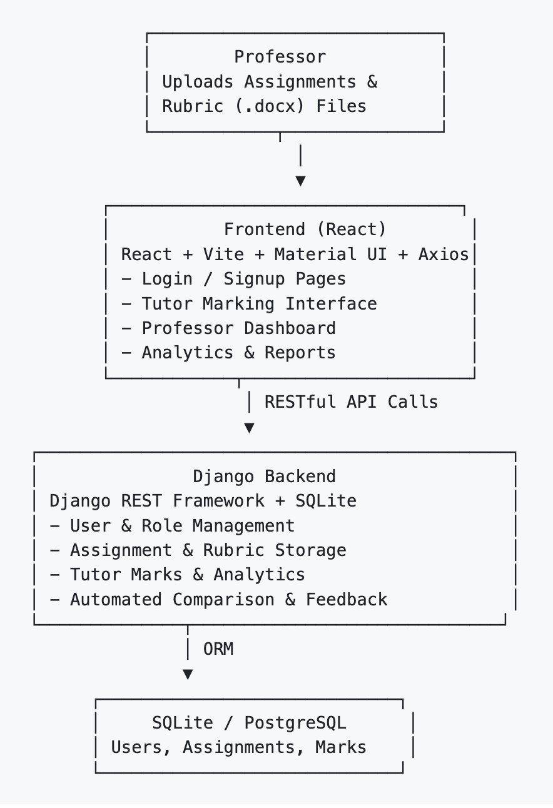
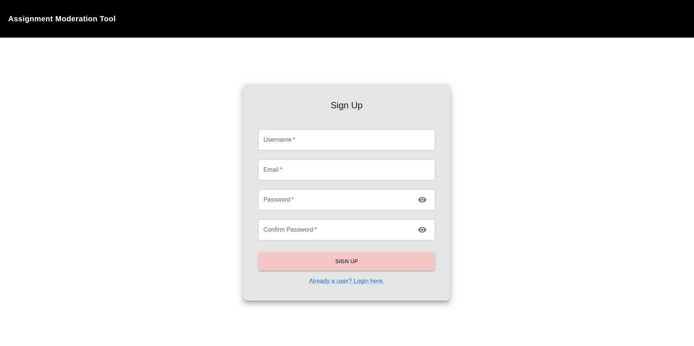
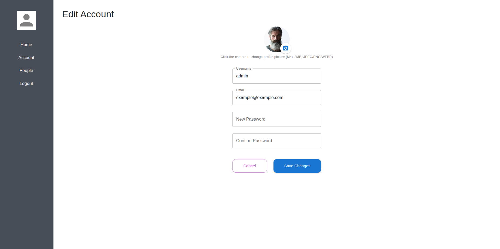
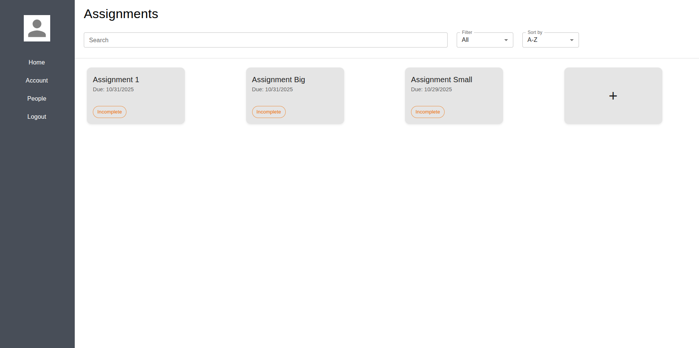
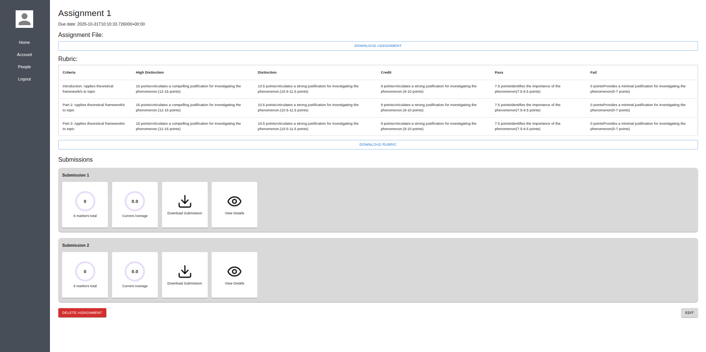

# Assignment Moderation Tool
COMP30022 IT Project — Deakin University Psychology Department  
Developed for **Carrie Ewin**, Psychology Lecturer at Deakin University

---

## Overview

The **Assignment Moderation Tool** is a full-stack web platform designed to automate the marking moderation workflow used in Deakin University’s School of Psychology.

Each semester, Carrie coordinates approximately **10 tutors** who all mark the same student assignments.  
Currently, moderation involves Excel spreadsheets, email comparisons, and manual difference calculations — an error-prone and time-consuming process.

This project replaces those manual steps with an integrated digital system that:

- Hosts assignments and rubrics in one place,  
- Allows **all tutors** to mark the **same assignments**,  
- Automatically aggregates and analyzes tutor marks,  
- Highlights inconsistencies, and  
- Generates performance analytics for the professor.

---

## Objectives

| Goal | Description |
|------|--------------|
| **Automate manual processes** | Replace spreadsheets, manual calculations, and email-based workflows with a web platform. |
| **Improve marking consistency** | Centralize marking to make cross-tutor comparison automatic. |
| **Increase transparency** | Allow professors to view tutor performance analytics at a glance. |
| **Reduce workload** | Automatically compute differences, averages, and outlier tutors. |

---

## Client & Requirements

### Client
**Carrie Ewin** — Psychology Lecturer, Deakin University

### Project Brief
Every semester, Carrie manages 10+ tutors who grade the same assignments.  
Currently, ensuring consistency is handled through Excel and manual checking,  
requiring hours of repetitive comparison and feedback.

**This project’s goal** is to develop a web-based **Assignment Moderation Tool**  
that streamlines the entire moderation process — from assignment upload to tutor analytics.

---

## System Architecture


---

##  Data Flow

```pgsql
┌───────────────────────────────────────────────┐
│ Professor uploads Rubric (.docx)              │
└───────────────────────────────────────────────┘
                     │
                     ▼
┌───────────────────────────────────────────────┐
│ System parses rubric into JSON using Mammoth.js│
└───────────────────────────────────────────────┘
                     │
                     ▼
┌───────────────────────────────────────────────┐
│ All tutors log in and mark the same           │
│ assignments online                            │
└───────────────────────────────────────────────┘
                     │
                     ▼
┌───────────────────────────────────────────────┐
│ Backend aggregates results, compares marks,   │
│ highlights deviations and averages            │
└───────────────────────────────────────────────┘
                     │
                     ▼
┌───────────────────────────────────────────────┐
│ Professor views analytics and consistency     │
│ reports                                       │
└───────────────────────────────────────────────┘

```
---

## Technology Stack

| Layer | Technology | Purpose |
|-------|-------------|----------|
| **Frontend** | React + Vite + Material UI + Tailwind | Build responsive, modern UI |
| **Backend** | Django + Django REST Framework | Provide secure APIs and business logic |
| **Database** | SQLite / PostgreSQL | Store users, rubrics, assignments, and marks |
| **Document Parser** | Mammoth.js | Convert `.docx` rubric to structured JSON |
| **Communication** | Axios + CORS | Handle frontend-backend requests |
| **Testing** | Django Test Framework | Validate APIs and consistency logic |

---

## Folder Structure

### Frontend (`frontend/`)

```pgsql
frontend/
│
├── public/
│ └── vite.svg
│
├── src/
│ ├── assets/
│ │ └── logo_deakin-rebrand-stacked.png
│ │
│ ├── components/
│ │ ├── AuthLayout.jsx # Login/register layout
│ │ ├── Navbar.jsx # Sidebar navigation
│ │ ├── RubricEditor.jsx # Professor rubric editor
│ │ └── Topbar.jsx # Top navigation bar
│ │
│ ├── pages/
│ │ ├── HomePage.jsx # Professor dashboard
│ │ ├── LoginPage.jsx # Login page
│ │ ├── SignupPage.jsx # Signup page
│ │ ├── CreateAssignmentPage.jsx # Upload assignment & rubric
│ │ ├── AssignmentPage.jsx # View assignment details
│ │ ├── MarkingPage.jsx # Tutor marking page
│ │ ├── ViewSubmissionPage.jsx # Professor compares tutors’ marks
│ │ ├── EditAssignmentPage.jsx # Edit rubric
│ │ ├── AccountPage.jsx / EditAccountPage.jsx # User account pages
│ │ ├── PeoplePage.jsx # Tutor list
│ │ ├── MarkerPage.jsx # Tutor marking overview
│ │ └── NotFoundPage.jsx # 404 error page
│ │
│ ├── utils/
│ │ └── rubricDocx.js # DOCX to JSON parser using Mammoth.js
│ │
│ ├── App.jsx / main.jsx # Routing and app entry point
│ ├── App.css / index.css # Global styles
│ └── vite.config.js # Build configuration
```

---

### Backend (`backend/`)

```pgsql
backend/
│
├── api/
│ ├── migrations/
│ │ ├── 0001_initial.py
│ │ ├── 0002_remove_user_staffid.py
│ │ └── 0003_alter_user_role.py
│ │
│ ├── admin.py # Admin registration
│ ├── apps.py # App registration
│ ├── forms.py # Upload & validation forms
│ ├── models.py # User, Assignment, Rubric, Mark models
│ ├── views.py # API logic and analytics endpoints
│ ├── urls.py # Route definitions
│ ├── tests.py # Backend tests
│ └── init.py
│
├── backend/
│ ├── settings.py # Django configuration (CORS, email, media)
│ ├── urls.py # Root router
│ ├── asgi.py / wsgi.py
│ └── init.py
│
├── media/ # Uploaded Rubrics, PDFs, Images
│ ├── *.docx
│ ├── *.jpeg / *.pdf
│
└── manage.py # Django entry point
```

---

## Features

### Professor Features
- Upload assignments and `.docx` rubrics.  
- Automatic parsing of rubric tables into JSON format.  
- View all tutors’ marks side by side.  
- Identify marking inconsistencies via color-coded reports.  
- Export analytics for moderation review.

### Tutor Features
- Log in securely.  
- View all available assignments.  
- Mark and comment directly online using shared rubrics.  
- Save drafts or finalize submissions.  
- Automatically receive confirmation and feedback summaries.

### System Intelligence
- Highlight outliers (high/low vs. professor reference).  
- Compute averages, standard deviation, and completion rate.  
- Provide real-time analytics to the professor dashboard.

---

## User Interface Overview

Below are the main pages implemented in the Assignment Moderation Tool frontend.  
Each page is designed using **React + MUI**, ensuring a consistent and responsive user experience.

---

### Login Page


- **Purpose:** Allows users (professors and tutors) to securely log in to the system using their registered email and password.  
- **Workflow:**
  1. The user enters their **email** and **password**.  
  2. Clicking the **“Login”** button sends the credentials to the backend for authentication.  
  3. If valid, the system redirects the user to the **Assignments Page** based on their role.  

- **Features:**
  - Password visibility toggle for convenience.  
  - **“Forgot password?”** link enables users to reset their password via email.  
  - **“Not a user? Sign up here.”** link allows new users to create an account.  
  - Handles invalid login attempts with error prompts.  

- **Technology Stack:**  
  Implemented using **React**, **Material UI**, and **Axios** for API communication.

### Sign-Up Page


- **Purpose:**  
  Enables new users to register for the Assignment Moderation Tool by providing their personal information and creating secure credentials.

- **Workflow:**
  1. The user enters a **Username**, **Email**, **Password**, and **Confirm Password**.  
  2. Clicking **“Sign Up”** sends the registration data to the backend for validation.  
  3. If successful, the user is redirected to the **Login Page** to sign in.  

- **Features:**
  - Input validation for required fields (empty fields trigger inline error messages).  
  - Password confirmation check to ensure both entries match.  
  - Displays error messages if an email is already registered or input is invalid.  
  - **“Already a user? Login here.”** link redirects to the login page.  
  - Backend automatically handles role assignment (Professor or Tutor) upon account creation.  

- **Technology Stack:**  
  Implemented using **React**, **Material UI**, and **Axios** for REST API communication with the Django backend.

### Edit Account Page


- **Purpose:**  
  Allows users to manage and update their personal information, including username, email, password, and profile picture.

- **Workflow:**
  1. The user navigates to the **Edit Account** page from the sidebar.  
  2. They can modify their **Username** and **Email**, or update their **Password**.  
  3. Clicking the camera icon lets the user upload a new **Profile Picture** (supports JPEG, PNG, or WEBP up to 2MB).  
  4. The user can **Cancel** changes or click **Save Changes** to update their profile.  

- **Features:**
  - Real-time form validation for empty or invalid fields.  
  - Password confirmation check to prevent mismatches.  
  - Profile photo upload with preview and file type restrictions.  
  - Clear **Cancel** and **Save Changes** buttons with visual feedback.  
  - Responsive layout ensuring consistent display across devices.  

- **Technology Stack:**  
  Built with **React**, **Material UI**, and **Axios**, communicating with the Django backend for profile management.

### Assignment Page


- **Purpose:**  
  Displays all existing assignments in a structured dashboard view, allowing users to search, filter, sort, and — for administrators — create new assignments.

- **Workflow:**
  1. Upon login, users are directed to the **Assignment Page**, which lists all assignments as interactive cards.  
  2. Users can **Search** assignments by name using the search bar.  
  3. **Filter** options allow users to display:
     - Completed assignments  
     - Incomplete assignments  
     - All assignments  
  4. **Sort** options enable users to order assignments by:
     - **A → Z** (alphabetically ascending)  
     - **Z → A** (alphabetically descending)  
     - **Newest First** (recently created)  
     - **Oldest First** (earliest created)  
  5. Administrators can click the **“+” card** to create a new assignment directly from this page.  
  6. Each assignment card is **clickable** — selecting a card opens the **Assignment Detail View**,  
     where users can see all assignment information including the title, description, rubric,  
     submission progress, and marking analytics.

- **Features:**
  - Interactive assignment cards showing title, due date, and completion status.  
  - Real-time search, filtering, and sorting without page reload.  
  - Clickable cards linking to detailed assignment information.  
  - Role-based access: only administrators can create, edit, or delete assignments.  
  - Responsive layout that adapts across different screen sizes.  

- **Technology Stack:**  
  Built with **React**, **Material UI**, and **Axios** for frontend logic;  
  integrated with the **Django REST API** for fetching, filtering, and managing assignment data.

### Assignment Detail / Analysis Page (Administrator View)


- **Purpose:**  
  Provides professors (administrators) with a detailed view of each assignment after selecting it from the **Assignment Page**.  
  This page summarizes tutor performance, displays consistency metrics, and allows file downloads for both the assignment and its rubric.

- **Workflow:**
  1. When an administrator clicks an assignment card on the **Assignment Page**, they are redirected to this **Detail / Analysis Page**.  
  2. The page displays the assignment’s **Title**, **Description**, **Upload Date**, and **Rubric Information**.  
  3. Administrators can **Download** both the **Assignment File** and **Rubric (.docx)** directly.  
  4. The system aggregates tutor submissions and computes:
     - The **Average Score** across all tutors.  
     - The **Total Score** for each submission.  
     - Comparative analysis between tutors’ marks.  
  5. Detailed analytics show the variation and consistency between tutor evaluations.  
  6. Administrators can review each submission’s result, download data, and export reports.

- **Features:**
  - Displays all uploaded files (assignment and rubric) with download buttons.  
  - Shows statistical metrics including **Average Score** and **Total Score**.  
  - Summarizes tutor grading performance using visual analytics and color-coded highlights.  
  - Allows export or download of analysis results for moderation reporting.  
  - Integrated with backend APIs for retrieving score data and computing consistency analytics.  

- **Technology Stack:**  
  Developed using **React**, **Material UI**, and **Axios** on the frontend,  
  integrated with the **Django REST Framework** backend for real-time data retrieval, score calculation, and analytics visualization.

## Testing

```bash
python manage.py test

Includes tests for:

Authentication & session validation

Assignment creation and editing

Rubric parsing

Tutor mark submissions

Aggregated analytics accuracy
```

## Setup and Run

### Backend
```bash
cd backend
python -m venv venv
source venv/bin/activate        # (Windows: venv\Scripts\activate)
pip install -r requirements.txt
python manage.py migrate
python manage.py runserver
```

### Frontend
```bash
cd frontend
npm install
npm run dev
```